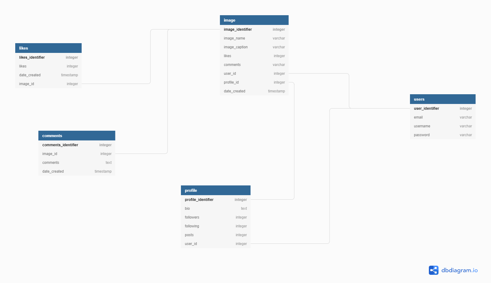

# Insta_Lite

## Description
Insta_Lite is a photo sharing app which allows users to assign filters to photos and share them with followers. ... Insta_Liters can sync their photo sharing to other social networks, so Instagram photos can be posted directly to Facebook, Tumblr, Twitter, Flickr, and Foursquare.. Visit the live site on ` https://immense-ravine-09970.herokuapp.com//`

## Author

* [**Anthony Muli**](https://github.com/antomuli)

## Features

As a user of the web application you will be able to:

1. Sign up and log in
2. View photos posted by other users
3. Follow other users
4. Comment on photos
5. Edit your profile

## Specifications
| Behavior            | Input                         | Output                        | 
| ------------------- | ----------------------------- | ----------------------------- |
| User visits the app and gets redirected to the login page  | User logs in | Directed to the home page where they see posted photos | 
If user has no account, they click on `sign up` | User signs up | User is redirected to the log in page |
|  Home page loads | Add comment  | Comment posted appears |
|  Homepage loads | Click `profile` | User's profile appears | 
| Homepage loads | Click `upload image` icon | User's redirected to a page where they can upload an image | 
| Homepage loads | Click `settings` icon | A modal appears where one can change their password or logout | 
| Homepage loads | User inputs in the search form and presses enter | Searched results show |
| A list of users displays | Click `follow` button to follow | Reloaded to the homepage

## Getting started
### Prerequisites
* python3.6
* virtual environment
* pip

### Cloning
* In your terminal:
        
        $ git clone https://github.com/antomuli/Insta_lite.git
        $ cd instalite

## Running the Application
* Install virtual environment using `$ python3.6 -m venv --without-pip virtual`
* Activate virtual environment using `$ source virtual/bin/activate`
* Download pip in our environment using `$ curl https://bootstrap.pypa.io/get-pip.py | python`
* Install all the dependencies from the requirements.txt file by running `python3.6 pip install -r requirements.txt`
* Create a database and edit the database configurations in `settings.py` to your own credentials.
* Make migrations

        $ python manage.py makemigrations instagram
        $ python3.6 manage.py migrate 

* To run the application, in your terminal:

        $ python3.6 manage.py runserver
        
## Testing the Application
* To run the tests for the class file:

        $ python3.6 manage.py test photos
        
## Technologies Used
* Python3.6
* Django
* HTML
* Bootstrap

This application is developed using [Python3.6](https://www.python.org/doc/), [Django](https://www.djangoproject.com/), [HTML](https://getbootstrap.com/) and [Bootstrap](https://getbootstrap.com/)

## Database Design

[Slack Me!](https://slack.com/intl/en-ke/)  @Anthony Muli

### LICENSE AND COPY RIGHT INFO.
MIT License

Copyright (c) 2020 Insta_Lite-Anthony

Permission is hereby granted, free of charge, to any person obtaining a copy of this software and associated documentation files (the "Software"), 
to deal in the Software without restriction, including without limitation the rights to use, copy, modify, merge, publish, distribute, sublicense, 
and/or sell copies of the Software, and to permit persons to whom the Software is furnished to do so, subject to the following conditions:

The above copyright notice and this permission notice shall be included in all copies or substantial portions of the Software.

THE SOFTWARE IS PROVIDED "AS IS", WITHOUT WARRANTY OF ANY KIND, EXPRESS OR IMPLIED, INCLUDING BUT NOT LIMITED TO THE WARRANTIES OF MERCHANTABILITY, 
FITNESS FOR A PARTICULAR PURPOSE AND NONINFRINGEMENT. IN NO EVENT SHALL THE AUTHORS OR COPYRIGHT HOLDERS BE LIABLE FOR ANY CLAIM, DAMAGES OR OTHER LIABILITY, 
WHETHER IN AN ACTION OF CONTRACT, TORT OR OTHERWISE, ARISING FROM, OUT OF OR IN CONNECTION WITH THE SOFTWARE OR THE USE OR OTHER DEALINGS IN THE SOFTWARE.

